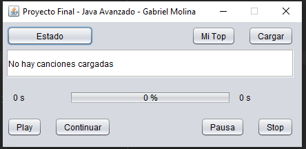
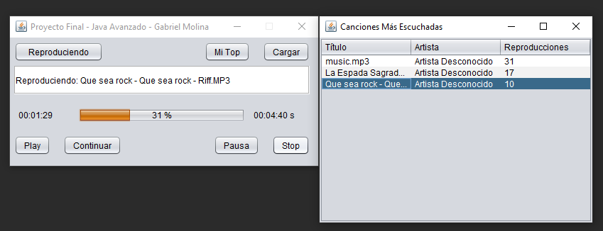

# Aplicación de Reproductor de Música

Esta es una aplicación de reproductor de música basada en Java que permite a los usuarios reproducir archivos de música, ver metadatos y gestionar listas de reproducción.

## Características

- Reproduce archivos de música en varios formatos.
- Muestra metadatos como bitrate y sample rate.
- Gestiona listas de reproducción.
- Realiza un seguimiento de las canciones más reproducidas.

## Capturas de Pantalla

### Interfaz del Reproductor de Música

### Reproductor de Música con Lista de Reproducción

## Tecnologías Utilizadas

- Java
- MySQL
- Swing (para la interfaz gráfica)
- BasicPlayer (para la reproducción de audio)

## Cómo Usar

1. Clona el repositorio.
2. Configura tu base de datos MySQL utilizando el script SQL proporcionado.
3. Compila y ejecuta la aplicación usando un IDE o terminal.

## Configuración de la Base de Datos

Asegúrate de tener MySQL instalado. Utiliza el script `music_library.sql` para configurar el esquema de la base de datos y los datos iniciales.

## Contribuciones

¡Se aceptan pull requests! Para cambios importantes, por favor abre primero un issue para discutir sobre lo que te gustaría cambiar.

## Licencia

[MIT](LICENSE)
